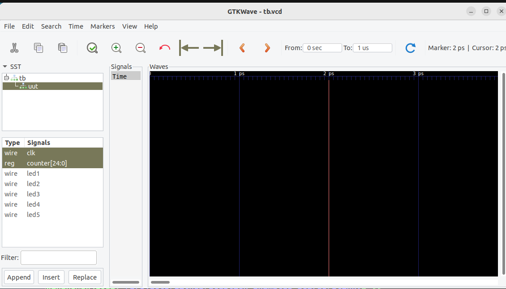

# IceStick-Examples

This project is a simple application for testing the programming of 
an IceStick on a Linux platform.  

These instructions have been verified on:
- Ubuntu 22.04.2 LTS 2023-04-30

# Install the tools

	sudo apt install fpga-icestorm
	sudo apt install nextpnr-ice40
	sudo apt install iverilog
	sudo apt install gtkwave

# Clone this repo, build, and run blinky on your iCEstick

Plug the IceStick into a USB port and then run the following from this cloned repo:

	git clone https://github.com/johnwinans/IceStick-Examples-Icarus.git
	cd IceStick-Examples-Icarus/blinky
	make
	make burn

# Build and run icarus to simulate this project and view a waveform of the counter

	make plot

In gtkwave, open (double-click) the 'tb' object in the tree, click on 'uut'. 

Then, in the signals box below click on the 'clk' signal and ctrl-click on 'counter[24:0]'
(so that they are both selected at the same time) and click the Append button at the 
bottom left.  

At this point, you can zoom and scroll around the waveform on the right to see the 
clock signal ticking and the counter advancing on the rising/positive edge of 
the 'clk' signal.

# iCEstick Docs

- iCEstick [page](https://www.latticesemi.com/icestick)
- iCEstick Evaluation Kit User's Guide [pdf](http://www.latticesemi.com/view_document?document_id=50701)

# iCE40 Docs

Family page:

- iCE40 Family [page](https://www.latticesemi.com/iCE40)

Direct links to my favorite documents:

- iCE40 LP/HX Datasheet [pdf](https://www.latticesemi.com/view_document?document_id=49312)
- iCE40 Programming and Configuration Techincal Note TN1248 [pdf](https://www.latticesemi.com/view_document?document_id=46502)
- iCE40 sysCLOCK PLL Design and User Guide [pdf](https://www.latticesemi.com/view_document?document_id=47778)
- Memory Usage Guide for iCE40 Devices [pdf](https://www.latticesemi.com/view_document?document_id=47775)
